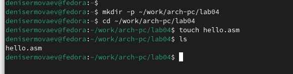
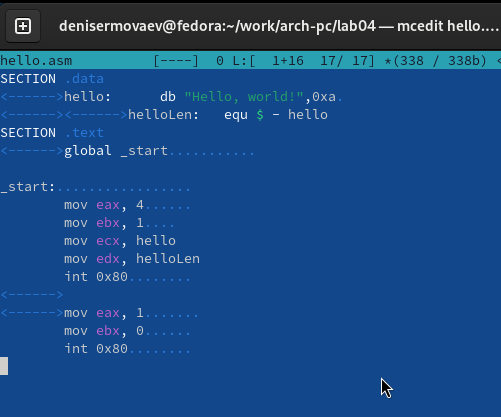
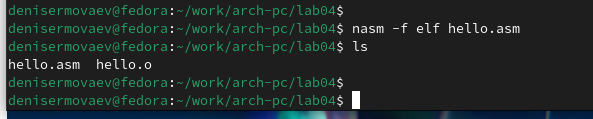
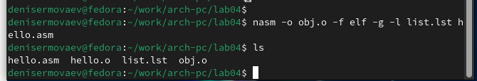
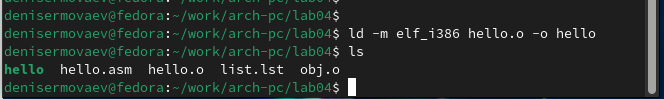
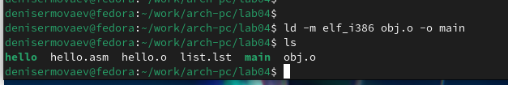
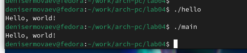
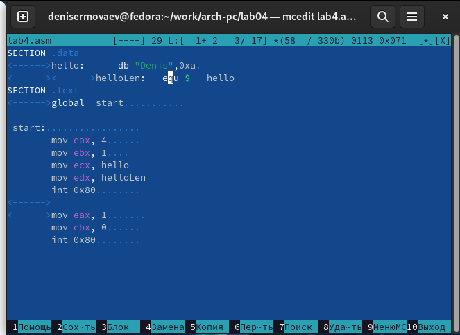
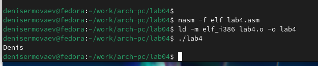

---
## Front matter
title: "Отчёт по лабораторной работе 4"
subtitle: "Создание и процесс обработки программ на языке ассемблера NASM"
author: "Ермолаев Денис Николаевич НБИбд-01-24"

## Generic otions
lang: ru-RU
toc-title: "Содержание"

## Bibliography
bibliography: bib/cite.bib
csl: pandoc/csl/gost-r-7-0-5-2008-numeric.csl

## Pdf output format
toc: true # Table of contents
toc-depth: 2
lof: true # List of figures
lot: true # List of tables
fontsize: 12pt
linestretch: 1.5
papersize: a4
documentclass: scrreprt
## I18n polyglossia
polyglossia-lang:
  name: russian
  options:
	- spelling=modern
	- babelshorthands=true
polyglossia-otherlangs:
  name: english
## I18n babel
babel-lang: russian
babel-otherlangs: english
## Fonts
mainfont: PT Serif
romanfont: PT Serif
sansfont: PT Sans
monofont: PT Mono
mainfontoptions: Ligatures=TeX
romanfontoptions: Ligatures=TeX
sansfontoptions: Ligatures=TeX,Scale=MatchLowercase
monofontoptions: Scale=MatchLowercase,Scale=0.9
## Biblatex
biblatex: true
biblio-style: "gost-numeric"
biblatexoptions:
  - parentracker=true
  - backend=biber
  - hyperref=auto
  - language=auto
  - autolang=other*
  - citestyle=gost-numeric
## Pandoc-crossref LaTeX customization
figureTitle: "Рис."
tableTitle: "Таблица"
listingTitle: "Листинг"
lofTitle: "Список иллюстраций"
lotTitle: "Список таблиц"
lolTitle: "Листинги"
## Misc options
indent: true
header-includes:
  - \usepackage{indentfirst}
  - \usepackage{float} # keep figures where there are in the text
  - \floatplacement{figure}{H} # keep figures where there are in the text
---

# Цель работы

Целью работы является освоение процедуры компиляции и сборки программ, написанных на ассемблере NASM.

# Выполнение лабораторной работы

## Программа Hello World

Для начала работы создал каталог lab04 с помощью команды mkdir и перешел в него с командой cd. Затем создал файл hello.asm (рис. [-@fig:001]).

{ #fig:001 width=70%, height=70% }

Открыл файл и написал код программы в соответствии с заданием (рис. [-@fig:002]).

{ #fig:002 width=70%, height=70% }

## Использование транслятора NASM

Сначала транслировал файл командой nasm, в результате чего был создан объектный файл hello.o (рис. [-@fig:003]).

{ #fig:003 width=70%, height=70% }

После этого выполнил трансляцию с дополнительными опциями. В результате были созданы файл листинга list.lst, объектный файл obj.o, а также добавлена отладочная информация (рис. [-@fig:004]).

{ #fig:004 width=70%, height=70% }

## Компоновка с использованием LD

Скомпоновал объектный файл с помощью команды ld, получив исполняемый файл (рис. [-@fig:005]).

{ #fig:005 width=70%, height=70% }

Повторил линковку для объектного файла obj.o, создав исполняемый файл main (рис. [-@fig:006]).

{ #fig:006 width=70%, height=70% }

Запустил полученные исполняемые файлы (рис. [-@fig:007]).

{ #fig:007 width=70%, height=70% }

## Самостоятельное задание

Скопировал программу в новый файл, изменил текст вывода с "Hello World" на свое имя (рис. [-@fig:008]) и запустил обновленную программу (рис. [-@fig:009]).

{ #fig:008 width=70%, height=70% }

{ #fig:009 width=70%, height=70% }

# Выводы

В ходе выполнения лабораторной работы я освоил этапы компиляции и компоновки программ на ассемблере с использованием nasm, а также изучил методы добавления отладочной информации и настройки вывода.
